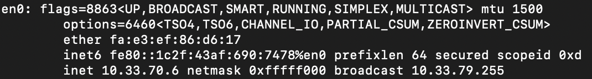
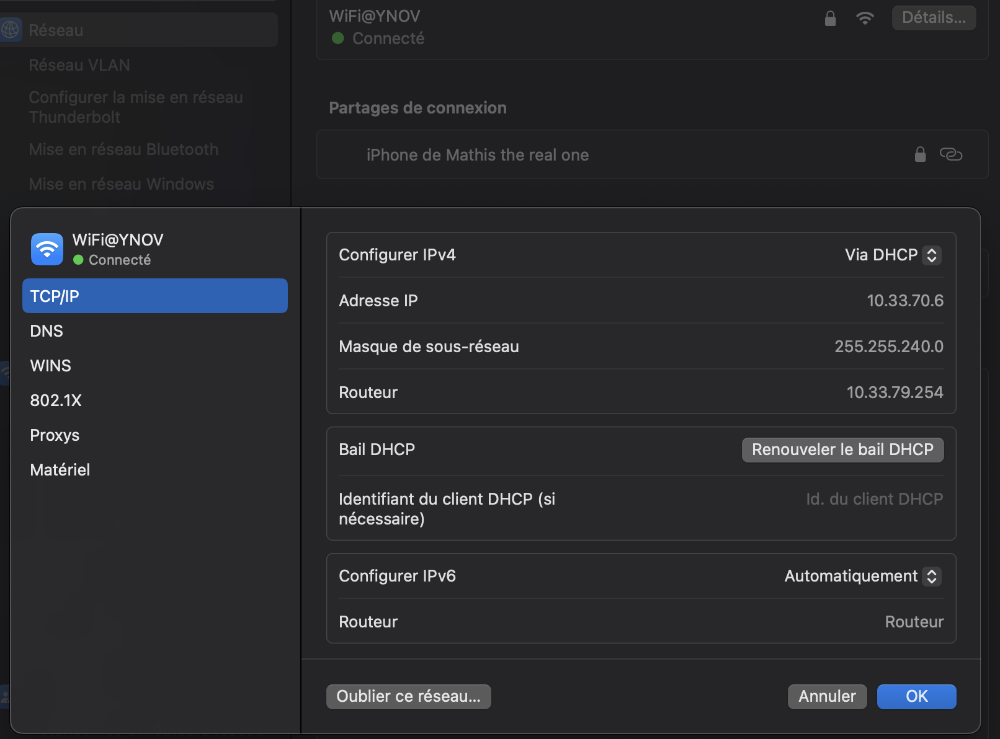

# Rapport de TP : Exploration Réseau & TCP/IP

Ce dépôt contient les résultats et observations du TP d'introduction aux réseaux, réalisé sous un environnement **macOS** (MacBook Air de Mathis).

---

## I. Exploration locale en solo

### 1. Affichage d'informations sur la pile TCP/IP locale

#### A. En ligne de commande (CLI)

**Interface WiFi (en0)**

Voici les informations récupérées via la commande `ifconfig` et `route` sur ma machine :



- **Nom de l'interface :** `en0`
- **Adresse MAC :** `fa:e3:ef:86:d6:17`
- **Adresse IP :** `10.33.70.6`
- **Masque de sous-réseau :** `255.255.240.0` (CIDR /20)
- **Adresse Broadcast :** `10.33.79.255`

> **Détail du calcul réseau (/20) :**
> Avec l'IP `10.33.70.6` et un masque `/20` :
>
> - Le réseau commence à `10.33.64.0`
> - Le réseau se termine à `10.33.79.255`
> - Cela représente une plage de **4096 adresses** (4094 hôtes utilisables).

**Passerelle (Gateway)**

Commande utilisée : `route -n get default`

- **Gateway :** `10.33.79.254`
- **MAC de la Gateway :** `7c:5a:1c:d3:d8:76` (Retrouvée plus tard via la table ARP).

#### B. En graphique (GUI)

Sous macOS, ces informations sont accessibles via :
`Réglages Système` > `Wi-Fi` > bouton `Détails` du réseau connecté > onglet `TCP/IP`.

---

### 2. Modifications des informations

#### A. Choix d'une nouvelle adresse IP

Pour changer d'adresse IP sans créer de conflit (IP Conflict), je dois trouver une adresse libre dans la plage `10.33.64.1` à `10.33.79.253`.

Étant donné la densité du réseau (visible via la table ARP très remplie), il est risqué de choisir une IP au hasard.

#### B. Scan réseau avec Nmap

J'utilise `nmap` pour scanner une petite plage d'adresses autour de la mienne afin de trouver un "trou" disponible.

_Scan sur la plage 10.33.70.200 à 10.33.70.210 :_

```bash
nmap -sn 10.33.70.200-210

Starting Nmap 7.92 ( https://nmap.org )
Nmap scan report for 10.33.70.200 [host down]
Nmap scan report for 10.33.70.201 [host down]
Nmap scan report for 10.33.70.202 [host up] -- Latency 0.045s
Nmap scan report for 10.33.70.203 [host down]
...
Nmap done: 11 IP addresses (3 hosts up) scanned in 2.05 seconds
```

Les adresses indiquées comme [host down] sont potentiellement libres.

#### C. Modification de l'adresse IP

Je décide de basculer mon IP vers `10.33.70.205`.

**Procédure sur macOS :**

`Aller dans Réglages Système` > `Réseau` > `Wi-Fi` > `Détails` > `TCP/IP`.



Passer "Configurer IPv4" de à DHCP à Manuellement.

Remplir :

Adresse IP : `10.33.70.205`

Masque : `255.255.240.0`

Routeur : `10.33.79.254`

## III. Manipulations d'autres outils/protocoles côté client

Cette partie se concentre sur l'analyse des protocoles qui permettent à ma machine de s'intégrer automatiquement au réseau (DHCP) et de naviguer sur le web (DNS).

### 1. Le protocole DHCP (Dynamic Host Configuration Protocol)

Le DHCP est le mécanisme qui m'a permis d'obtenir automatiquement mon adresse IP sans avoir à la configurer manuellement.

#### Analyse de la trame DHCP

Sous macOS, la commande `ipconfig getpacket en0` permet d'inspecter le dernier paquet d'offre reçu du serveur DHCP.

**Informations extraites de ma connexion :**

- **Opération (`op`) :** `BOOTREPLY` (Le serveur a répondu à ma demande).
- **Mon adresse IP (`yiaddr`) :** `10.33.70.6`
- **Adresse du Serveur DHCP (`server_identifier`) :** `10.33.79.254`
- **Masque de sous-réseau :** `255.255.240.0` (CIDR /20)
- **Routeur (Gateway) :** `10.33.79.254`

**Analyse du Bail DHCP (Lease Time) :**
Le bail définit combien de temps je peux garder cette IP avant de devoir la renouveler.

- **Valeur brute (Hex) :** `0x89bb`
- **Conversion Décimale :** \(35259\) secondes.
- **Durée réelle :** Environ **9 heures et 47 minutes**.

> **Interprétation :** Contrairement à une box domestique (bail de 24h), le réseau de l'école utilise des baux plus courts (~10h), ce qui correspond à une journée de cours type. Cela permet de libérer les adresses IP le soir pour les étudiants du lendemain.

### 2. Le protocole DNS (Domain Name System)

Le DNS est l'annuaire qui traduit les noms de domaine (ex: `ynov.com`) en adresses IP.

#### Configuration actuelle

D'après la commande précédente, mes serveurs DNS sont configurés manuellement ou par le DHCP sur des résolveurs publics performants :

1.  **Primaire :** `8.8.8.8` (Google)
2.  **Secondaire :** `1.1.1.1` (Cloudflare)

#### Tests de résolution (Lookup)

**Test 1 : Site de l'école**
Commande : `nslookup ynov.com`

```text
Server:		8.8.8.8
Address:	8.8.8.8#53

Non-authoritative answer:
Name:	ynov.com
Address: 104.26.11.233
Name:	ynov.com
Address: 172.67.74.226
Name:	ynov.com
Address: 104.26.10.233
```

**Test 2 : Google**
Commande : `nslookup google.com`

```text
Server:		8.8.8.8
Address:	8.8.8.8#53

Non-authoritative answer:
Name:	google.com
Address: 216.58.213.78
```

**_Analyse des résultats :_**

"Non-authoritative answer" : Cela signifie que le serveur 8.8.8.8 n'héberge pas lui-même la zone DNS de ynov.com. Il a interrogé un autre serveur pour répondre.

Multiples adresses IP pour Ynov : Le domaine ynov.com renvoie plusieurs IP. Ce sont des adresses appartenant à Cloudflare. Cela indique que le site utilise un CDN (Content Delivery Network) pour la protection et la rapidité, et non un serveur unique hébergé à l'école.
