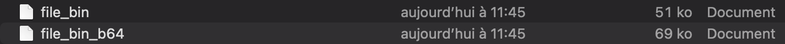

## 1. Questions

**1. Base64 est-il un chiffrement ? Pourquoi ?**

Non, `Base64 n’est pas un chiffrement`. C’est un simple encodage réversible qui transforme des octets binaires en caractères imprimables, sans secret/mot de passe ni sécurité.

**Pourquoi la taille du fichier change-t-elle après encodage ?**

Base64 encode chaque bloc de 3 octets en 4 caractères ASCII, ce qui ajoute un `overhead`, plus des éventuels caractères de fin de ligne.
​
**Quel est approximativement le pourcentage d’augmentation ?**

En théorie l’augmentation est d’environ `33%` (3 octets → 4 caractères).

​

**Quelle méthode permet de vérifier rigoureusement que deux fichiers sont identiques ?**

Utiliser un outil qui compare le contenu octet par octet (ex: diff), ou comparer une empreinte comme `sha1sum/sha256sum` sur les deux fichiers : si les hash sont identiques, les fichiers sont identiques.

## 2. Questions

**Pourquoi les deux fichiers chiffrés sont-ils différents ?**

À cause du sel aléatoire et éventuellement du vecteur d’initialisation, qui changent à chaque chiffrement : même message + même mot de passe → résultat chiffré différent, ce qui empêche de reconnaître des contenus identiques.
​

**Quel est le rôle du sel ?**

Le sel rend l’attaque par tables pré-calculées (rainbow tables) inefficace, assure que deux fichiers chiffrés avec le même mot de passe ne se ressemblent pas, et force l’attaquant à travailler fichier par fichier.
​

**Que se passe-t-il si une option change lors du déchiffrement ?**

Si l’algorithme, le sel, PBKDF2 ou la fonction de hash ne correspondent pas exactement à ceux utilisés au chiffrement, le déchiffrement échoue (erreur) ou produit des données illisibles/corrompues.

**Pourquoi utilise-t-on PBKDF2 ?**

PBKDF2 dérive une clé forte à partir d’un mot de passe humain, en appliquant une fonction de hash de nombreuses fois avec un sel, ce qui ralentit les attaques par force brute et par dictionnaire.
​

**Différence entre encodage et chiffrement ?**

Encodage : transformation réversible sans secret (ex: Base64), le but est la compatibilité de format.
​
Chiffrement : transformation qui rend les données inintelligibles sans clé secrète, le but est la confidentialité.

## 3. Questions

**Pourquoi la clé privée ne doit-elle jamais être partagée ?**

Elle permet de déchiffrer tous les messages chiffrés avec la clé publique et de signer au nom du propriétaire. Si elle fuit, la confidentialité et l’authentification sont cassées.

**Pourquoi RSA n’est-il pas adapté au chiffrement de gros fichiers ?**

RSA est lent, consomme beaucoup de ressources et ne peut chiffrer que des blocs de taille limitée (liée à la taille de la clé). On l’utilise plutôt pour de petites données (clé de session).

**Différences dans les paramètres clé publique / clé privée ?**

La clé publique contient uniquement :
n : le modulo et e : l'exposant public

La clé privée contient :
n, e, d : l'exposant privé, p et q : les deux nombres premiers utilisés pour calculer n, d1 et d2 : exposants optimisés, coefficient : utilisé pour l'optimisation CRT.

**Rôle du modulo dans RSA ?**

`n = p × q`

n=p×q définit l’espace de calcul (toutes les opérations de chiffrement/déchiffrement se font modulo n), et sa factorisation est supposée difficile, ce qui assure la sécurité.
​

**Pourquoi utiliser RSA pour chiffrer une clé AES plutôt qu’un document entier ?**

Parce que RSA est lent et limité en taille, tandis qu’AES est très rapide sur de gros volumes. On chiffre donc une petite clé AES avec RSA (asymétrique) et on chiffre les données avec AES (symétrique) : c’est le chiffrement hybride.

## 4. Questions

**Que se passe-t-il après modification du fichier ? Pourquoi ?**

La vérification de la signature échoue, car le hash du fichier modifié ne correspond plus au hash signé. Une minuscule modification change complètement l’empreinte.
​

**Rôle du hachage dans la signature ?**

Il réduit le message à une empreinte de taille fixe, ce qui rend la signature plus rapide et permet de détecter toute modification.
​

**Différence entre signature numérique et chiffrement ?**

Signature : on utilise la clé privée pour signer (authentifier, garantir l’intégrité), et la clé publique pour vérifier.
​
Chiffrement : on utilise la clé publique pour chiffrer (confidentialité) et la clé privée pour déchiffrer.

## BONUS

**Problèmes du chiffrement symétrique (AES, etc.) :**

- Distribution de clé compliquée : il faut partager la même clé secrète de manière sûre.

- Gestion des clés difficile quand il y a beaucoup de correspondants (une clé par paire).

**Problèmes du chiffrement asymétrique (RSA, etc.) :**

- Repose sur des hypothèses mathématiques (facteurisation, etc.) qui peuvent être en danger à cause des ordinateurs quantiques.
