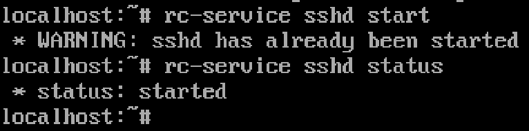

## TP – Administration SSH et Serveur Web Nginx

## Partie 1 – Mise en place de l’environnement virtualisé

**Voici les commndandes que j'ai éffectué sur ma VM :**

```bash
ip a
ping 8.8.8.8
```


**Et ici la commande utilisé pour ping ma VM via mon terminal**

```bash
ping 192.168.2.2
```


## Partie 2 – Serveur SSH

Ensuite je vérifie que openssh est bien installé via ces commandes :

```bash
rc-service sshd start
rc-service sshd status
```



J'ai dû me connecter sur ma VM via cette commande:

```bash
ssh root@192.168.2.2
```


J'ai généré une clé avec la commande suivante :

```bash
ssh-keygen -t ed25519
```


Aprés je copie la clé sur le serveur :

```bash
ssh-copy-id root@192.168.2.2
```


Et pour finir je me suis reconnecté sur ma VM via SSH sauf que cette fois je n'ai pas eu à taper mon mot de passe, ce qui confirme que ça a fonctionné.


**Explication**

Dans cette partie, nous avons installé le serveur SSH sur la machine virtuelle Alpine à l’aide du paquet openssh-server. Nous avons vérifié que le service était actif.

Nous nous sommes ensuite connectés à la VM depuis la machine hôte avec la commande `ssh utilisateur@IP_VM`.

Afin de sécuriser l’accès, nous avons généré une paire de clés SSH sur la machine cliente avec `ssh-keygen`, puis copié la clé publique sur le serveur grâce à `ssh-copy-id`.

Après cette configuration, la connexion SSH fonctionne `sans mot de passe`, grâce à l’authentification par clé, ce qui améliore la sécurité du serveur.

## Partie 3 – Sécurisation SSH

## Partie 4 – Transfert de fichiers

## Partie 5 – Analyse des logs et sécurité

## Partie 6 – Tunnel SSH

## Partie 7 – Nginx et HTTPS

## Partie 8 – Firewall et permissions

## Partie 9 – Validation finale
