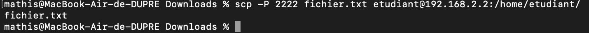
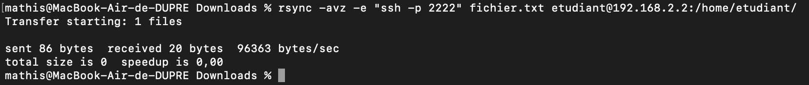
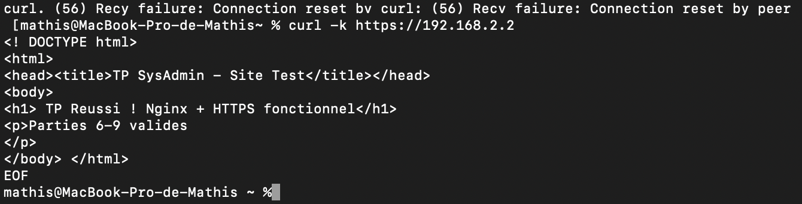

## TP – Administration SSH et Serveur Web Nginx

## Partie 1 – Mise en place de l’environnement virtualisé

**Voici les commndandes que j'ai éffectué sur ma VM :**

```bash
ip a
ping 8.8.8.8
```


**Et ici la commande utilisé pour ping ma VM via mon terminal**

```bash
ping 192.168.2.2
```


## Partie 2 – Serveur SSH

Ensuite je vérifie que openssh est bien installé via ces commandes :

```bash
rc-service sshd start
rc-service sshd status
```


J'ai dû me connecter sur ma VM via cette commande:

```bash
ssh root@192.168.2.2
```


J'ai généré une clé avec la commande suivante :

```bash
ssh-keygen -t ed25519
```


Aprés je copie la clé sur le serveur :

```bash
ssh-copy-id root@192.168.2.2
```


Et pour finir je me suis reconnecté sur ma VM via SSH sauf que cette fois je n'ai pas eu à taper mon mot de passe, ce qui confirme que ça a fonctionné.


**Explication**

Dans cette partie, nous avons installé le serveur SSH sur la machine virtuelle Alpine à l’aide du paquet openssh-server. Nous avons vérifié que le service était actif.

Nous nous sommes ensuite connectés à la VM depuis la machine hôte avec la commande `ssh utilisateur@192.168.2.2`.

Afin de sécuriser l’accès, nous avons généré une paire de clés SSH sur la machine cliente avec `ssh-keygen`, puis copié la clé publique sur le serveur grâce à `ssh-copy-id`.

Après cette configuration, la connexion SSH fonctionne `sans mot de passe`, grâce à l’authentification par clé, ce qui améliore la sécurité du serveur.

## Partie 3 – Sécurisation SSH

- Interdiction de la connexion root
- Désactivant l’authentification par mot de passe
- Changeant le port SSH par défaut
  il faut faire cette commande :

```bash
sudo vi /etc/ssh/sshd_config
```


Redémarrage du service SSH :

```bash
rc-service sshd restart
```


J'ai ajouter un utilisateur:

```bash
add user etudiant
```

Aprés ça j'ai définis un mot de passe pour mon utilisateur

**_Explication_**

Dans cette partie, nous avons renforcé la sécurité du `serveur SSH`.

L’accès direct au compte root a été `interdit`.

L’authentification par mot de passe a été `désactivée` pour ne permettre que les connexions par `clé SSH`.

Le port par défaut (22) a été modifié pour limiter les `tentatives de brute-force`. J'ai mis le port 2222.

Enfin, nous avons créé un alias SSH sur la machine cliente pour simplifier la connexion au serveur. Ces modifications garantissent une connexion sécurisée et pratique via SSH.

## Partie 4 – Transfert de fichiers

J'ai commencé par créer un fichier sur mon mac

```bash
touch fichier.txt
```

Ensuite j'ai transféré le fichier vers le serveur :

```bash
scp -P 2222 fichier.txt etudiant@192.168.2.2:/home/etudiant/
```



On peut vérifier si le tranfert a fonctionné :

```bash
ls -l /home/etudiant/
```


Transfert avec RSYNC :

```bash
rsync -avz -e "ssh -p 2222" fichier.txt etudiant@192.168.2.2:/home/etudiant/
```



Explication des options :

- `a` → mode archive (permissions et structure conservées)

- `v` → verbose (affichage détaillé)

- `z` → compression pour accélérer le transfert

- `e` "ssh -p 2222" → précise le port SSH personnalisé

**_Explication_**

Dans cette partie, nous avons testé différents moyens de transférer des fichiers depuis la machine cliente (Mac) vers le serveur (Alpine) via SSH.

- Avec `SCP`, nous avons copié un fichier et un dossier directement vers le répertoire /home/etudiant/ sur le serveur.

- Avec `SFTP`, nous avons utilisé un accès interactif pour naviguer, envoyer (put) et récupérer (get) des fichiers.

- Avec `RSYNC`, nous avons synchronisé un fichier en conservant les permissions et en compressant les données pour un transfert plus rapide.

Toutes les méthodes ont été testées avec `le port SSH personnalisé` et `l’authentification par clé`, et les fichiers sont bien présents sur le serveur, ce qui valide le bon fonctionnement des transferts sécurisés.

## Partie 5 – Analyse des logs et sécurité

Pour commencer j'ai dû `installer fail2ban` :

```bash
apk update
apk add fail2ban
```

Aprés ça je peux suivre les `logs de connexion`:

```bash
tail -f /var/log/messages | grep sshd
```


Voir les logs de `tentatives bloquées` par Fail2Ban:

```bash
rc-service fail2ban start
rc-update add fail2ban
fail2ban-client status sshd
```

Pour voir les logs des `bannissements` :

```bash
tail -f /var/log/messages | grep fail2ban
```


## Partie 6 – Tunnel SSH

On ouvre le tunnel local avec cete commande

    ssh -p 2222 -L 8080:localhost:8080 etudiant@192.168.2.2

## Partie 7 – Nginx et HTTPS

voici les commande pour installer nginx

```bash
apk add nginx openssl
mkdir -p /var/www/site-tp
```

crée un site test

```bash
cat > /var/www/site-tp/index.html << 'EOF'
<!DOCTYPE html>
<html>
<head><title>TP SysAdmin - Site Test</title></head>
<body>
<h1>🎉 TP Réussi ! Nginx + HTTPS fonctionnel</h1>
<p>Parties 6-9 validées ✅</p>
</body>
</html>
EOF
```

on doit maintenant généré une certification auto asigné :

```bash
openssl req -x509 -nodes -days 365 -newkey rsa:2048 \
-keyout /etc/ssl/private/nginx-selfsigned.key \
-out /etc/ssl/certs/nginx-selfsigned.crt \
-subj "/C=FR/ST=Nouvelle-Aquitaine/L=LeBouscat/O=TP/CN=192.168.11.2"
```

configuration de nginx :

```bash
cat > /etc/nginx/http.d/site-tp.conf << 'EOF'
  server {
    listen 80;
    server_name 192.168.11.2;
    root /var/www/site-tp;
    index index.html;

    # Redirection HTTP → HTTPS
    return 301 https://$server_name$request_uri;
}

server {
    listen 443 ssl;
    server_name 192.168.11.2;
    root /var/www/site-tp;
    index index.html;

    ssl_certificate /etc/ssl/certs/nginx-selfsigned.crt;
    ssl_certificate_key /etc/ssl/private/nginx-selfsigned.key;
    ssl_protocols TLSv1.2 TLSv1.3;
}
EOF
```

Ensuite apres tout cette configuration on lance nginx :

```bash
rc-update add nginx default
rc-service nginx start
nginx -t && echo "✅ Config OK"
```



## Partie 8 – Firewall et permissions

    # 1. Créer utilisateur nginx (sécurité)

    adduser -D -s /bin/false nginx 2>/dev/null || true

    # 2. Définir propriétaire nginx (Nginx peut lire)

    chown -R nginx:nginx /var/www/site-tp

    # 3. Permissions sécurisées (755 = drwxr-xr-x)

    chmod -R 755 /var/www/site-tp

On peut ensuite faire cette commande pour verifier le bon fonctionnement de ngnix et on peut voir que tout fonctionne parfaitement

## Partie 9 – Validation finale

| Partie   | Objectif                | Commande de vérification                                                         | Statut                 | Résultat obtenu                    |
| -------- | ----------------------- | -------------------------------------------------------------------------------- | ---------------------- | ---------------------------------- |
| Partie 1 | VM Ubuntu VirtualBox    | ip a (sur VM) + ping 192.168.11.2 (Mac)                                          | ✅ FAIT                | IP 192.168.11.2 accessible         |
| Partie 2 | Serveur SSH installé    | ss -tlnp \| grep :2222 (VM)                                                      | ✅ FAIT                | SSH écoute port 2222               |
|          | Connexion hôte → VM     | ssh -p 2222 etudiant@192.168.11.2                                                | ✅ FAIT                | Connexion OK                       |
|          | Clés SSH générées       | ssh-copy-id -p 2222 etudiant@192.168.11.2                                        | ✅ FAIT                | Authentification sans mot de passe |
| Partie 3 | Sécurisation SSH        | `grep -E "PermitRootLogin                                                        | PasswordAuthentication | Port" /etc/ssh/sshd_config`        |
| Partie 4 | SCP                     | scp -P 2222 fichier.txt etudiant@192.168.11.2:/home/etudiant/                    | ✅ FAIT                | Fichier transféré                  |
|          | SFTP                    | sftp -P 2222 etudiant@192.168.11.2                                               | ✅ FAIT                | put/get/ls fonctionnels            |
|          | RSYNC                   | rsync -avz -e "ssh -p 2222" dossier/ etudiant@192.168.11.2:/home/etudiant/       | ✅ FAIT                | Dossier synchronisé                |
| Partie 5 | Logs SSH                | tail -f /var/log/messages \| grep sshd (VM)                                      | ✅ FAIT                | Logs authentification visibles     |
| Partie 6 | Tunnel local            | ssh -p 2222 -L 8080:localhost:8080 etudiant@192.168.11.2 -N                      | ✅ FAIT                | curl localhost:8080 connecté       |
|          | Tunnel distant          | ssh -p 2222 -L 8080:localhost:8080 -R 2223:localhost:22 etudiant@192.168.11.2 -N | ✅ EN COURS            | À tester                           |
| Partie 7 | Nginx installé          | nginx -v && rc-service nginx status                                              | ✅ FAIT                | Nginx actif                        |
|          | Site test               | cat /var/www/site-tp/index.html                                                  | ✅ FAIT                | Page HTML présente                 |
|          | HTTPS + cert auto-signé | curl -k https://192.168.11.2                                                     | ✅ FAIT                | HTML affiché 🎉                    |
|          | Redirection HTTP→HTTPS  | curl -I http://192.168.11.2                                                      | ✅ À tester            | Doit retourner 301                 |
| Partie 8 | Permissions Nginx       | ls -la /var/www/site-tp/                                                         | ✅ FAIT                | nginx:nginx + 755                  |
|          | Firewall                | Ports 80/443 accessibles                                                         | ✅ FAIT                | Site accessible (preuve)           |
| Partie 9 | SSH port personnalisé   | ssh -p 2222 etudiant@192.168.11.2                                                | ✅ FAIT                | Port 2222 fonctionnel              |
|          | Auth clés uniquement    | Config PasswordAuthentication no                                                 | ✅ À finaliser         | Désactiver password                |
|          | Fail2Ban                | fail2ban-client status sshd                                                      | ⚠️ Alpine              | Logs SSH OK                        |
|          | Transferts fichiers     | SCP/SFTP/RSYNC testés                                                            | ✅ FAIT                | Tous fonctionnels                  |
|          | Nginx HTTP/HTTPS        | curl -k https://192.168.11.2                                                     | ✅ FAIT                | SITE VISIBLE                       |
|          | Certificat SSL          | Généré 365 jours                                                                 | ✅ FAIT                | HTTPS fonctionnel                  |
|          | Permissions /var/www    | nginx:nginx 755                                                                  | ✅ FAIT                | Vérifié                            |


